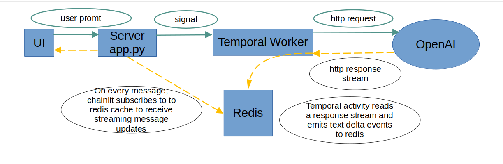

# Introduction 

# Getting Started

## Add environment variables to .env file

```
OPENAI_API_KEY=
OPENAI_ASSISTANT_ID=
OPENAI_GATEWAY_URL=
```

## Create an assistant with get_weather function

Go to https://platform.openai.com/assistants/ , create an assistant with default parameters. Make sure to add a function get_weather from examples.


# Running everything locally

This will start all services in background mode:

```
docker compose up -d
```

To check logs of specific service, use:

```
docker compose logs chainlit
```

To rebuild and start specific service:

```
docker compose up chainlit --build --force-recreate --no-deps 
```


Once everything is up, use following addresses:

Chat UI: http://localhost:8000
Temporal UI: http://localhost:8001

If case you want to explore internal temporal data structures in postgres:

PGAdmin: http://localhost:8002

Note that you'll need to right-click on Servers -> Register -> Server and add a server with HOST=postgresql (name of the service in docker-compose.yml), login and password are in .env file

## Debugger

It may be more convenient to run all service containers in docker and debug main app and temporal worker locally.

To run app and temporal worker with local python, do following

1. Stop docker containers (you can comment them out in docker-compose as well):

```
docker compose down chainlit temporal-worker
```

Create python env, install requirements

```
python -m venv .venv
source .venv/bin/activate
pip install -r requirements.txt
```

then, use configurations for vscode/codium in .vscode/launch.json.

## Redis messages debugging:

1. Install redis-cli package. On debian it's 'sudo apt install redis-tools'
2. Run `redis-cli MONITOR` to see all events.


# Architecture

All messages (user promts) are going through temporal for durable execution.

Streaming messages back to UI is important, so Redis is used as a message broker.

